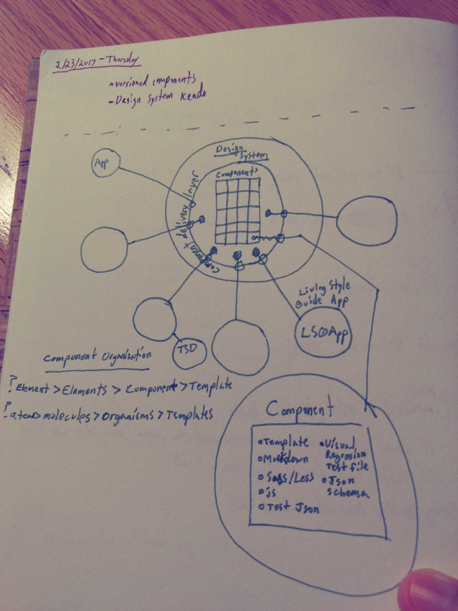

I love design systems. There are no lack of blog posts on the topic, and each one has more-or-less the same definition for them: A pattern library of user interface components, a living style guide, and documentation on when to use certain components. These are the tangible outputs. However, there are much harder to define facets to what a design system is. 

<!-- end -->

## (Hint) It's People

A library of UI code is only as valuable as its usage. People have to actually consume the outputs of the design system and contribute back to it. If no one in your company advocates for the system, then good luck finding any adopters. Before long, it will be added to the pile of abandoned, non-starter initiatives. 

The _system_ part of the name really doesn't characterize this notion all that well. Sure, there is a solid chunk of engineering involved, but the softer aspects of managing it are what make or break successful execution. I wish a term like "company design ecosystem" were more catchy because it's at least closer to acknowledging the human-factors aspects of what I'm driving towards. 

In order for a design system to thrive successfully, every employee from the designer to the CEO has to support it. It has to be a priority infrastructure item. It has to be the starting point for every new project. It has to be there from the very start of your company. Otherwise, you're 100% guaranteeing redesign, refactoring, rebranding, and ultimately, reduced profits.



The above diagram illustrates how someone could think about the system. The system acts as a service for its dependent users; other products. In other words, the design system is just another product and its customers are your company's product development teams. This means that the design system must have a dedicated team to foster its design, development, release, and roadmap. It cannot be left to select passionate designers or else competing priorities will always snuff out that passion and any momentum built up. 

At the core of it all are the company's guiding principles; abstract terms such as "concise, spacious, and friendly" for example. Each user interface component created thereafter is created to align with those principles; perhaps the card component has generous whitespace and short bits of pleasantly worded text. 

>Aenean quis nisi eros. Praesent a libero et ante sagittis dictum eget id ipsum. Duis sit amet bibendum justo. Morbi faucibus vehicula bibendum. Praesent ornare hendrerit commodo. Praesent sit amet nisi mauris. Aenean maximus pharetra lacinia. Praesent efficitur erat id dolor laoreet rhoncus. Cras eu efficitur arcu. Nunc pretium, nunc sit amet rutrum molestie, arcu nisi tempus ligula, eu dapibus leo tortor in quam.


```javascript
$(document).ready(function() {
    console.log('Welcome!');
})
```