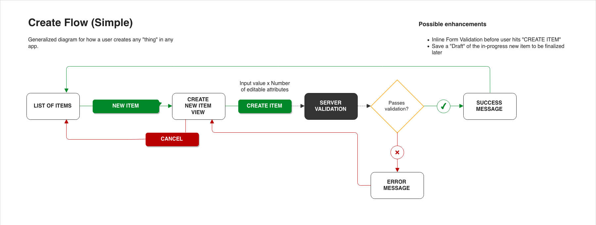

Over the years, I've come to the conclusion that any user interface can be distilled down into its functional essence in the form of the _abstract flow diagram_

<!-- end -->

## Abstraction and A Question

The concept of generalizing functionality isn't new. Reusability of code decreases when it depends on being in a very specific context in order for it to function properly. In other words, to make code reusable, you must define its functionality as an encapsulated unit; able to stand on its own or to be composed with other components, all while maintaining the intended functionality. 

### Abstraction in Code
I often glean this sentiment for abstraction in relation to front end code. Especially in component-based js frameworks like Angular. You define a component's markup template, some presentation logic, and styles. Then you instantiate it among other components within a page, and feed it dynamic data at runtime. Thereby giving it meaning and context.

### Abstraction in Design
I've even come across this concept in the design process as well. Designers will establish the visual building blocks like buttons or form elements and compose them together into pages. In Sketch terms, these building blocks are known as "symbols". When creating pages, designers will instantiate a symbol and then specify styling overrides and example text to give meaning and context to the design.

### Abstraction Benefits
This idea of defining abstract components and then instantiating them with real content is hyper-efficient. The authoring process looks like this: You code and design the component by defining what is dynamic and static. Then when you make use of the component, you feed it real content in order to create meaning and value. The real benefit comes when you have a new project to design and build. If you have a library of abstracted designs and components, you can easily just compose them together to fit different use cases. 

## The Question

Speaking of Use Cases, it's great that we have the process for defining our components in code and design, but I have a lingering question:
* Can we apply an abstraction mindset to our use-cases?

## Use Cases are Too Specific

Often, features found within projects are presented as unique to that project. In other words, each one is bespoke to that project. But they have to be. In reality many features found within projects could be used in other projects. Like a "log in" feature. I think we need the final piece of the user interface design puzzle. A design artifact that is a blueprint for how user interface components behave for all of our use cases. I've found that flow diagrams fit this need perfectly. 

A flow diagram is a pattern of behavior that includes a set of steps to accomplish a goal. They communicate the invisible forks in logic that I often stumbled through when designing. Even today, I sometimes still blindsided by a gap in my design when a developer asks me "what does the UI do when there's a communication error with the backend?". 

However, it is both daunting and cost prohibitive to spend time flow diagramming a whole system; with all of its logical branches, states, and features. It's even less tempting to repeat that process for every new project. We have to acknowledge the human factors at play here:
1. Humans don't digest large bodies of information efficiently
2. Repeating work is also not efficient

We now have the necessary building blocks for creating a user interface in code, visuals, and now behavior.

## Core Behaviors

The sheer number of digital services available to us today would have you believe that they all perform unique tasks. However, I would argue that a user only has a handful of core behaviors that they can act out using _any_ digital product. These tasks are often referred to as **CRUD** operations:
* Create
* Read
* Update
* Delete

## Example
Let's take the **Create** behavior. A user of a digital product can often create things. Oftentimes, they will create "posts" on social media, create a new email thread, create a new document, etcetera. This "create" behavior can manifest in an infinite number of ways depending on  branding, industry, and use-case, but the core behavior is almost _always_ the same. See the diagram below:

